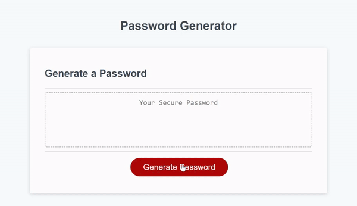

# Simple Password Generator

## Description 

A simple, non-cryptographic password generator that allows a user to select what kind of characters to be included as well as password length (between 8 and 128 characters).

The generator uses Math.random to pseudo-randomly pull values from a 2 dimensional array. While there is no guarantee that a password with more than one type of character requested will include all characters requested, the logic is set up to make this vanishingly unlikely. 

## Table of Contents

If your README is very long, add a table of contents to make it easy for users to find what they need.

* [Usage](#usage)
* [Credits](#credits)
* [License](#license)
* [Features](#features)
* [Test](#tests)

## Usage 

Below is a brief example of the generator in use and the error messages you can get.

## Credits

Base HTML and CSS code was supplied by Jerome Chenette, along with some basic javascript code (commented as such).

## [License](./LICENSE)
This website uses the open-source MIT License.

## Features

The code features error messages if inappropriate inputs are entered for the password (such as a character length of "cat" or no selected character types).

The password can be made up of any combination of uppercase letters, lowercase letters, numbers, and special characters (not counting spaces). 

## Tests

The Chrome console produces a "[Violation] 'click handler' tool XXXX ms" when a password is generated. This is because the user takes time to provide nessecary inputs. Since rearrangment of this code doesn't prevent this delay, I have left the flow as is. 

You can see where the slowdown is with the console timers I've included around the functions that display the confirm and prompt dialogue boxes.

---